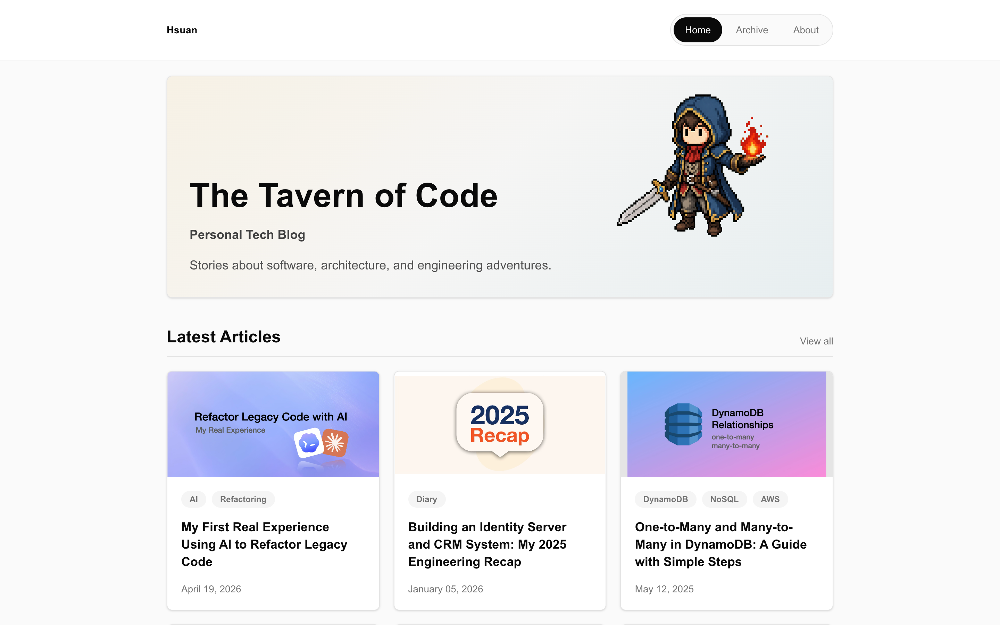
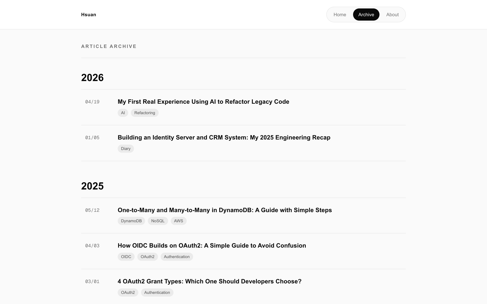
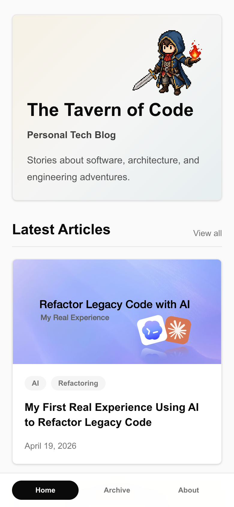
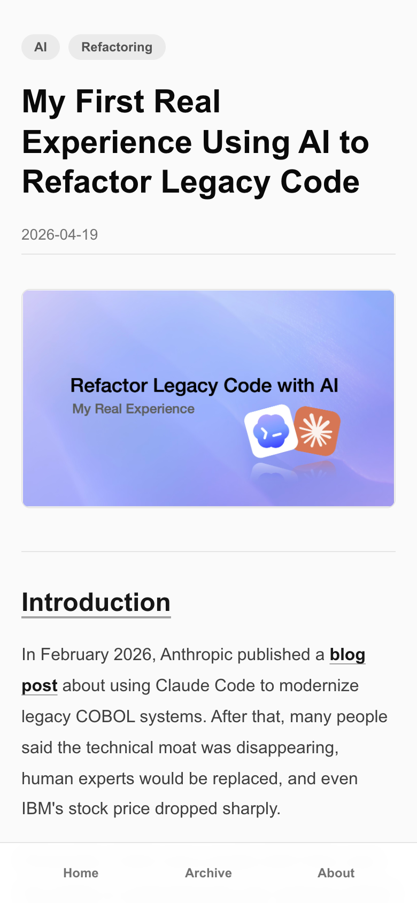

# Hsuan Next Blog

A personal tech blog built with Next.js and React. Articles are written as Markdown files and transformed into styled blog posts.



## Features

- Markdown-based article publishing
- Frontmatter support for title, date, excerpt, tags, and cover image
- Dynamic article pages generated from `content/articles`
- Article archive grouped by year
- Responsive desktop and mobile layouts

## Screenshots

### Article List



### Mobile

<p>
  
  
</p>

## Markdown Articles

Each article lives in its own folder:

```text
content/articles/
  article-slug/
    index.md
```

Example frontmatter:

```md
---
title: "Article Title"
date: "2026-01-01"
excerpt: "Short article summary."
tags: ["Next.js", "Markdown"]
coverImage: "/images/articles/example/cover.png"
---
```

The folder name becomes the article slug, and the Markdown content becomes the blog post page.

## Tech Stack

- Next.js 16.2.10
- React 19.2.4
- TypeScript
- Tailwind CSS 4

## Development

```bash
npm install
npm run dev
npm run build
npm run lint
```
